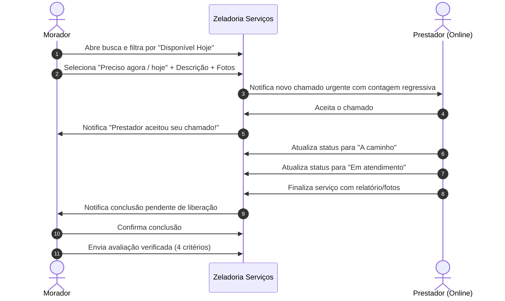
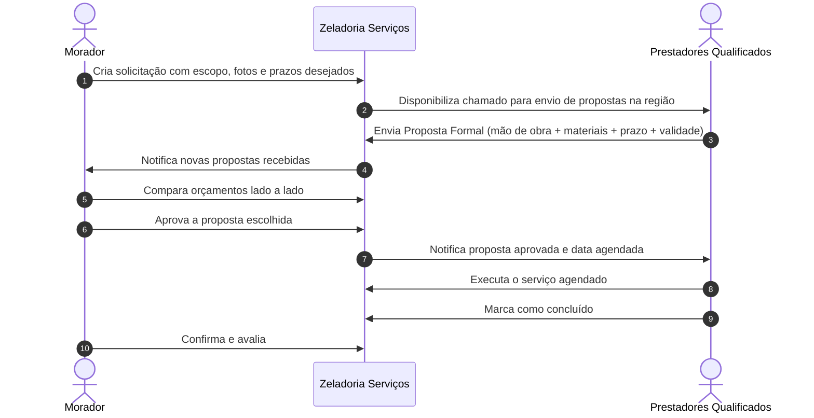

# Fluxos de Contratação e Atendimento — Zeladoria Serviços

## 1. Fluxo A: Atendimento Rápido / Sob Demanda (Emergencial)

Indicado para: *Troca de disjuntor, torneira pingando, desentupimento de ralo, chaveiro, pequenos reparos*.

---

## 2. Fluxo B: Orçamento e Propostas (Projetos / Reformas)

Indicado para: *Pintura de apartamento, móveis planejados, automação residencial, reforma de banheiro*.

